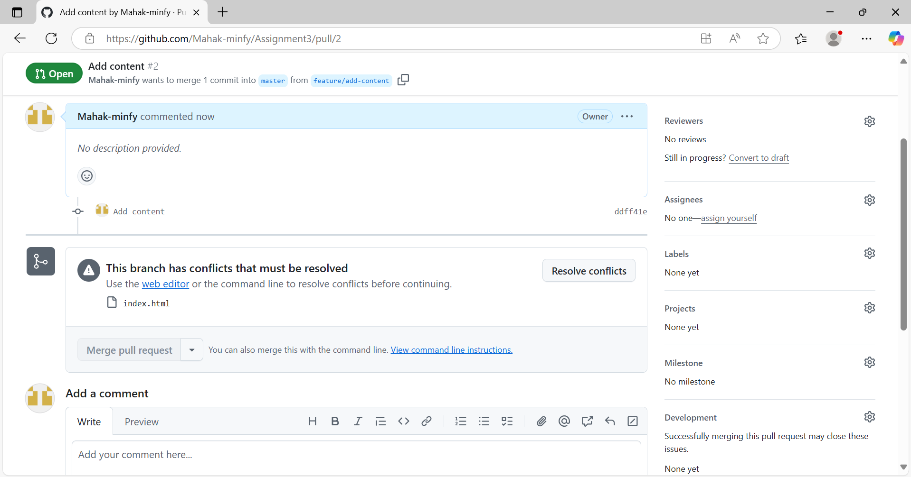
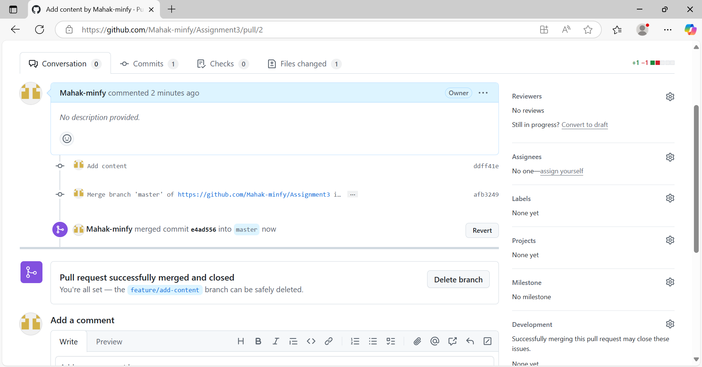

### Steps Taken:
Created a new Git repository and set up the master branch.
Created the feature/update-styling branch from the master.
Made changes in the feature/update-styling branch.
Committed changes in the feature/update-styling branch.
Created the feature/add-content branch from master.
Made changes in the feature/add-content branch.
Committed changes in the feature/add-content branch.
Opened pull requests for both branches.
Merged feature/update-styling into master.
Attempted to merge feature/add-content into master, resulting in a merge conflict.

### Screenshot of conflict:

### Screenshot of Merged:

### Resolving the Merge Conflict:
Upon attempting to merge feature/add-content into master, Git identified a conflict in the HTML file, as both branches modified the same lines.

Steps to Resolve:
1.Ran git status to list files with conflicts.
2.Opened the conflicted HTML file to examine the conflicting changes.
3.Manually edited the file to integrate both sets of changes, ensuring the content and styling were both preserved.
4.Used git add <file> to stage the resolved file.
5.Committed the merge with a message indicating the resolution.
6.Pushed the updated master branch to the remote repository.
